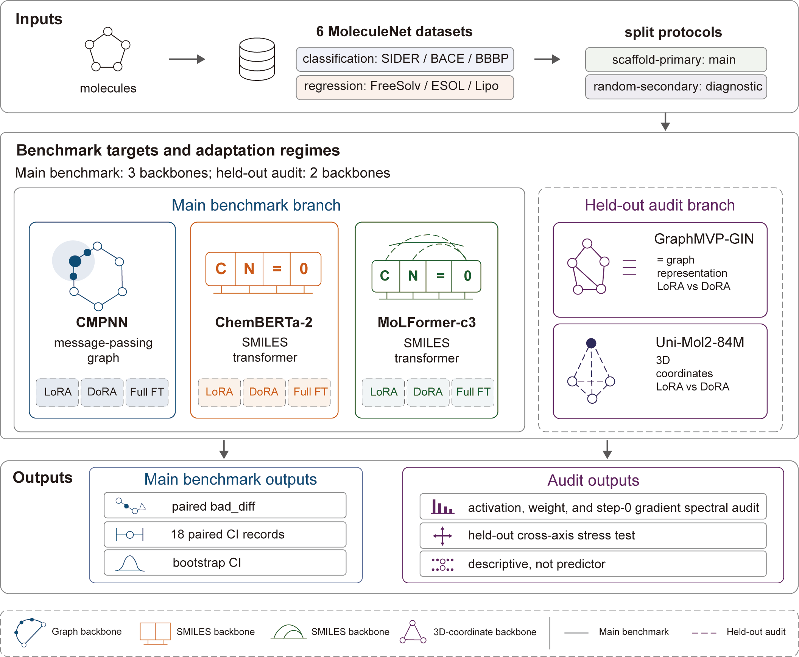

# BAM-PEFT

BAM-PEFT is a benchmark and audit package for parameter-efficient fine-tuning of molecular foundation and graph neural network backbones. The released code supports the controlled LoRA/DoRA/full fine-tuning comparisons, scaffold split reuse, bootstrap confidence intervals, and source-data reproduction for the activation, weight, and step-0 gradient spectral audit used in the associated manuscript.

## Workflow overview



Figure 1 is a hand-drawn documentation asset that provides a workflow overview; it is not a script-generated reproducibility artifact.

## Attribution

This project is based on a fork of KANO (HICAI-ZJU/KANO; Fang et al., Nature Machine Intelligence 2023; MIT license). BAM-PEFT adds LoRA/DoRA fine-tuning, benchmark orchestration, held-out audit summaries, and spectral audit utilities on top of the KANO-derived codebase. The packaged CMPNN pretrained checkpoint in `pretrained/original_CMPN_0623_1350_14000th_epoch.pkl` is from KANO and is included for reproducibility. The processed molecular datasets used by the experiments are the KANO-provided processed versions of MoleculeNet/DeepChem datasets; the CSV files are not redistributed in this package.

## Layout

- `src/`: cleaned chemprop/KANO-derived training code and BAM-PEFT PEFT additions.
- `scripts/`: cleaned experiment, split, bootstrap, and spectral-audit scripts.
- `docs/`: documentation assets, currently the hand-drawn Figure 1 workflow overview.
- `splits/`: 36 scaffold split JSON files for six datasets and seeds 0, 1, 2, 10, 100, and 1000.
- `data_source/README.md`: data acquisition, required schema, and placement instructions.
- `results/`: minimal locked CSV/JSON source results for manuscript figures and tables.
- `envs/`: environment requirement snapshots for the five backbone environments.
- `pretrained/`: KANO CMPNN pretrained checkpoint used by the CMPNN fine-tuning scripts.
- `THIRD_PARTY_NOTICES.md`: third-party attribution and license notes.
- `MANIFEST.sha256`: SHA256 manifest for all packaged files except the manifest itself.

## Environments

Install the requirement file matching the backbone to reproduce:

- CMPNN: `envs/requirements_kapt-5090.txt`
- ChemBERTa-2: `envs/requirements_kapt-chemberta2.txt`
- MoLFormer-c3: `envs/requirements_kapt-molformer-c3.txt`
- GraphMVP-GIN held-out summaries: `envs/requirements_kapt_graphmvp.txt`
- Uni-Mol2-84M held-out summaries: `envs/requirements_kapt_unimol2.txt`

Set these paths before running scripts:

```bash
export BAM_REPO_ROOT=/path/to/BAM
export DATA_ROOT=/path/to/kano_processed_data
export BAM_CMPNN_PRETRAINED="$BAM_REPO_ROOT/pretrained/original_CMPN_0623_1350_14000th_epoch.pkl"
export BAM_TMP_DIR="$BAM_REPO_ROOT/outputs/tmp"
```

For Uni-Mol2-specific reruns not included in this lightweight script set, use `UNIMOL2_CHECKPOINT` to point to the external Uni-Mol2 checkpoint. The locked held-out result tables are already included under `results/spec_a_r3_production/` and `results/spec_b_v3/`.

## Data

This package does not redistribute the six processed CSV files. Download the KANO processed data from the KANO repository and place the files as described in `data_source/README.md`. The original dataset sources are MoleculeNet and DeepChem.

## Reproduction Sketch

1. Prepare an environment from `envs/` and activate it.
2. Set `BAM_REPO_ROOT`, `DATA_ROOT`, `BAM_CMPNN_PRETRAINED`, and optionally `BAM_TMP_DIR`.
3. Reuse the scaffold splits in `splits/` for scaffold-primary runs.
4. Use `scripts/b2_stage2/` for transformer LoRA/DoRA runs.
5. Use `scripts/n4_full_ft/` for Full FT baselines.
6. Use `scripts/n5_rank_sensitivity/` for rank sensitivity.
7. Use `scripts/bootstrap_ci/` to recompute paired bootstrap summaries from locked paired-difference JSON files.
8. Use `scripts/r1_signature/` for extraction of activation, weight, and step-0 gradient spectra and for correlation summaries.

The `results/` directory contains the locked source tables used to render manuscript figures and tables. This repository includes only the hand-drawn Figure 1 workflow overview under `docs/`; it does not include Figures 2–5, Supporting Information figures, or figure-rendering scripts. The rendering scripts are intentionally excluded because they are coupled to the manuscript build tree.

## Manuscript ↔ code terminology

The manuscript uses descriptive terms, whereas the code, data columns, file paths, and provenance records retain the original identifiers shown below. These identifiers are preserved to maintain traceability to archived run records.

| Manuscript terminology | Code, schema, and archive identifiers |
| --- | --- |
| activation spectra | `F1` / `run_f1` / `bam_peft_r1_f1_activation_features*` |
| weight spectra | `F2` / `run_f2` / `bam_peft_r1_f2_weight_features*` |
| step-0 gradient spectra (or surface) | `F3` / `run_f3` / `extract_step0_gradient` / `bam_peft_r1_f3_gradient_features*` |
| feature-family labels | `feature_family="F1"` / `feature_family="F3"` |
| held-out PEFT production stage and outcomes | `spec_a_r3_production` / `r3_production_v1_*` |
| k = 4 gradient–weight subspace alignment fraction | `alignment_A4` / `alignment_A4_mean` |
| k = 16 gradient–weight subspace alignment fraction | `alignment_A16` / `alignment_A16_mean` |
| standardized PEFT amenability gap | `z_gap`; archived prediction: `predicted_z_gap` |
| mean top-4/8/16 step-0 gradient spectral energy | `grad_top4_energy_mean` / `grad_top8_energy_mean` / `grad_top16_energy_mean` |
| mean normalized step-0 gradient effective rank | `grad_erank_norm_mean` |
| mean normalized step-0 gradient spectral entropy | `grad_spectral_entropy_norm_mean` |

## Citation

Please cite the BAM-PEFT manuscript when available. Also cite KANO for the base fork, checkpoint, and processed-data source:

```bibtex
@article{fang2023knowledge,
  title={Knowledge graph-enhanced molecular contrastive learning with functional prompt},
  author={Fang, Yin and Zhang, Qiang and Zhang, Ningyu and Chen, Zhuo and Zhuang, Xiang and Shao, Xin and Fan, Xiaohui and Chen, Huajun},
  journal={Nature Machine Intelligence},
  year={2023}
}
```

## License

BAM-PEFT additions are released under the MIT license. Third-party components retain their original licenses and attribution requirements; see `THIRD_PARTY_NOTICES.md` and `src/chemprop/torchlight/LICENSE`.
